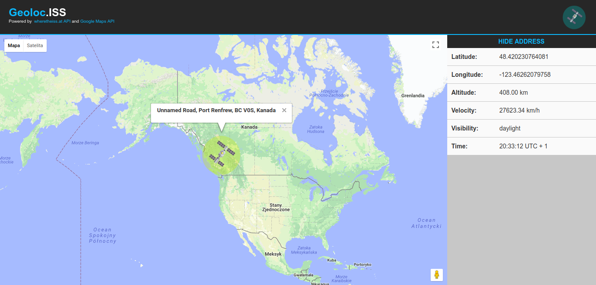
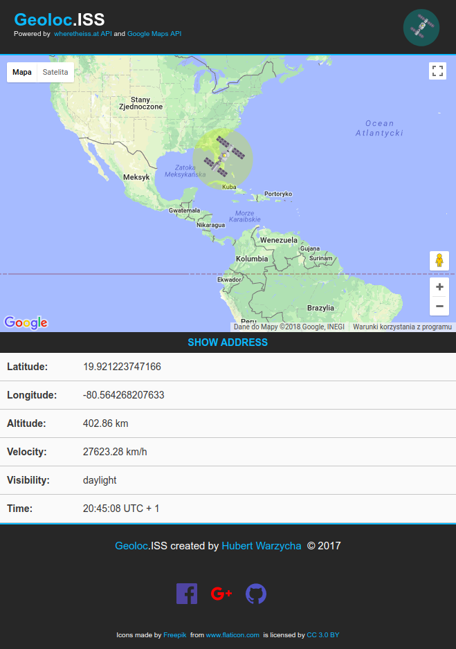

# geolocISS
React single page app that uses the google maps API and wheretheiss.at API to display the current position of the international space station (ISS).

## Technologies:
  * React,
      - flux,
      - react-google-maps,
      - react-spinkit,
      - prop-types,
  * Fetch API,
      - whatwg-fetch
  * Bootstrap,
      - bootstrap-sass,
      - jquery (used only as a bootstrap dependency)
  * RWD,
  * Sass,
      - autoprefixer
      - extract-text-webpack-plugin
  * ES6,
      - babel-preset-env,
      - babel-core,
      - babel-preset-react,
      - babel-preset-stage-2,
      - babel-preset-es2015
  * Webpack,
      - webpack-dev-server,  
      - babel-loader,
      - css-loader,
      - postcss-loader,
      - sass-loader,
      - style-loader,
      - url-loader,
      - file-loader,
      - img-loader,
